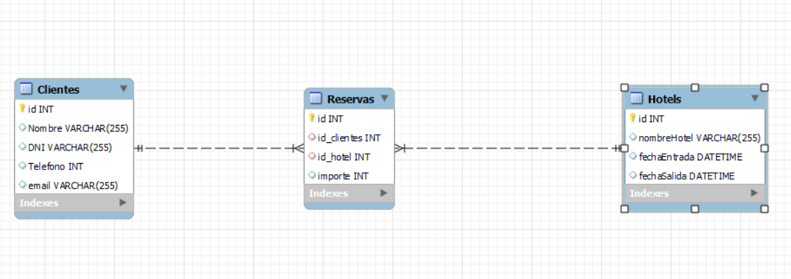

# Proyecto API  de Reservas de Hotel
<h3>He creado una API para servir datos para un hotel con Express y squelize</h3>

 

## Instalación
<h3>Para poder utilizar el proyecto tendrás que instalar node.js y clonar el repositorio de gitHub con este comando:</h3>

```
https://github.com/Kanandee/ProyectoHotelApi.git
```


<h3>Para poder instalar las dependencias utilizaremos:</h3>

```
npm install
```

## End Points
<h3>Para clientes</h3>

| Get  | ruta | Clientes| valor |
| ------------- | ------------- | ------------- |------------- |
| Get | /clientes
| Get | /clientes  | /id  | /:id  |
| Get  | /clientes   | /name  | /:name |
| Get | /clientes   | /dni  | /:dni |
| Get  | /clientes   | /email  | /:email |
| Get | /clientes  | /telefono  | /:telefono |

<h3>Para hoteles</h3>

| Get  | ruta | Hoteles| valor |
| ------------- | ------------- | ------------- | ------------- |
| Get | /hoteles  
| Get | /hoteles  | /:id |
| Get | /hoteles  | /name | /:name |
| Get  | /hoteles  | /fechaEntrada  | /:date |
| Get | /hoteles   | /fechaSalida | /:date |


<h3>Para reservas</h3>

| Get  | ruta | Reservas| valor |
| ------------- | ------------- | ------------- | ------------- |
| Get | /reservas 
| Get | /reservas   | /id | /:id |
| Get | /reservas   | /cliente | /:id_cliente |
| Get  | /reservas   | /hotel  | /:id_hotel |

## Creado con

* JavaScript - Lenguaje principal
* Node.js - Entorno de ejecución de JavaScript
* Express - Modulo
* Sequelize - ORM
* MySQL - Lenguaje
